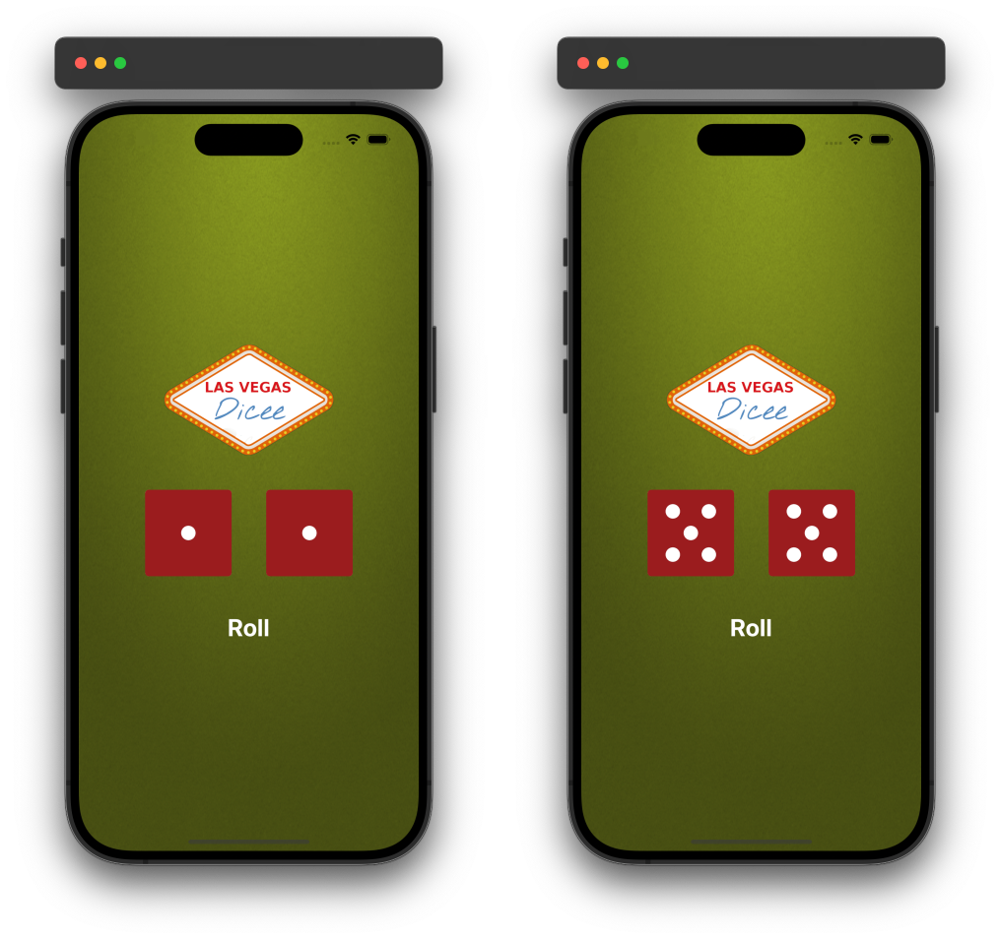

# Dicee-SwiftUI

## Introduction
The Dicee-SwiftUI app is a simple iOS application that simulates the rolling of two dice using SwiftUI framework. Upon pressing the "Roll" button, the app randomly generates numbers for two dice, updating their respective images to reflect the dice rolls. This app serves as an introduction to SwiftUI concepts such as `@State`, views (`View` protocol), `ZStack`, `VStack`, `HStack`, and basic UI interactions.

### Preview

  

## Features
- **Dice Rolling Simulation**: Simulates the rolling of two dice with random number generation.
- **Dynamic UI**: Updates the dice images dynamically based on the rolled numbers.
- **Responsive Layout**: Utilizes SwiftUI's layout system to ensure proper alignment and scaling across different iOS devices.

## Code Structure
The app is structured around two main SwiftUI views:

### ContentView
- Manages the main user interface (`ZStack`, `VStack`, `HStack`).
- Contains state variables (`@State`) for tracking the numbers on the left and right dice (`leftDiceNumber` and `rightDiceNumber`).
- Displays background image, logo, dice views (`DiceView`), and roll button.

### DiceView
- Represents a single dice view with a number (`n`) passed as a parameter.
- Displays the corresponding dice image based on the value of `n`.

## Conclusion
The SwiftUI Dicee app demonstrates the power and simplicity of building user interfaces declaratively with SwiftUI. It provides a foundational understanding of how to manage state, create responsive layouts, and handle user interactions within a SwiftUI-based iOS application. This app can serve as a starting point for learning more advanced SwiftUI features and developing more complex iOS applications.